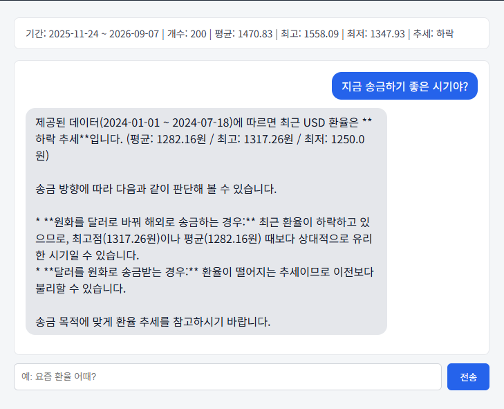
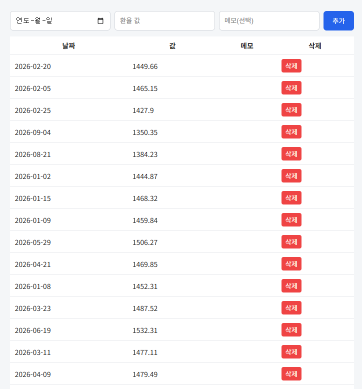
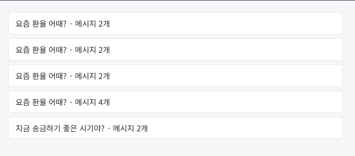

# 💱 환율 AI 비서

미국달러(USD) 환율 시계열 데이터를 분석하고, 그 결과를 AI 챗봇에 컨텍스트로 주입하여
"내 데이터를 아는 AI 비서"와 대화할 수 있는 웹 서비스입니다.

일반적인 챗봇은 "요즘 환율 어때?"라는 질문에 실시간 데이터 없이 일반적인 답변만 내놓지만,
이 서비스는 Firestore에 저장된 최근 200영업일치 실제 환율 데이터를 요약하여 시스템 프롬프트에 주입한 뒤
GPT(Gemini) API를 호출하므로, 저장된 데이터 범위 안에서 정확한 근거를 바탕으로 답변합니다.

## 🛠 기술 스택

| 구분 | 기술 |
|---|---|
| 백엔드 | FastAPI, Uvicorn, Pydantic |
| 데이터베이스 | Firebase Firestore |
| AI | Google Gemini API (google-genai SDK, gemini-3.6-flash) |
| 프론트엔드 | HTML / CSS / JavaScript (Vanilla, 프레임워크 미사용) |
| 배포 | Render(백엔드), Vercel(프론트엔드) |
| 데이터 출처 | Frankfurter API (ECB 기준 USD→KRW 환율, 최근 200영업일치) |

## 🚀 배포 URL

- 프론트엔드: https://m1-2-steel.vercel.app/
- 백엔드 API: https://m1-2-jmkr.onrender.com
- Swagger UI: https://m1-2-jmkr.onrender.com/docs

> ⚠️ 백엔드는 Render 무료 티어를 사용하여, 일정 시간 요청이 없으면 서버가 슬립 모드로 전환됩니다.
> 슬립 상태에서 첫 요청 시 최대 30초~1분 정도 응답이 지연될 수 있습니다. 잠시 기다렸다가 다시 시도해주세요.

## 💻 로컬 실행 방법

### 백엔드

```bash
# 가상환경 생성 및 활성화
python -m venv .venv
.venv\Scripts\activate      # Windows
# source .venv/bin/activate  # macOS/Linux

# 패키지 설치
pip install -r requirements.txt

# .env 파일 생성 (아래 "환경 변수" 참고)

# 서버 실행
uvicorn backend.main:app --reload
```

- 로컬 서버: http://127.0.0.1:8000
- Swagger UI: http://127.0.0.1:8000/docs

### 프론트엔드

`frontend/config.js`의 `API_BASE_URL`을 로컬 백엔드 주소로 바꾼 뒤, `frontend/index.html`을 브라우저로 열면 됩니다.

```javascript
// 로컬 테스트 시
const API_BASE_URL = "http://127.0.0.1:8000";

// 배포된 백엔드 사용 시
const API_BASE_URL = "https://m1-2-jmkr.onrender.com";
```

## 🔑 환경 변수 (최소 세트)

프로젝트 루트에 `.env` 파일을 만들고 아래 값을 채워주세요 (`.env.example` 참고).

| 변수명 | 설명 |
|---|---|
| `GEMINI_API_KEY` | Google AI Studio에서 발급받은 Gemini API 키 |
| `FIREBASE_SERVICE_ACCOUNT_JSON` | Firebase 서비스 계정 키 (로컬: 파일 경로 / 배포 환경: JSON 문자열 전체) |

> 서비스 계정 키와 API 키는 절대 GitHub에 커밋하지 않으며, `.gitignore`로 제외되어 있습니다.
> Render 배포 시에는 `FIREBASE_SERVICE_ACCOUNT_JSON`에 JSON 파일 내용을 통째로 값으로 등록합니다.

## 📊 데이터 구조

- **`data` 컬렉션**: `(date, value, memo)` 형태의 환율 데이터, 최근 200영업일치
- **`conversations` 컬렉션**: `(title, messages[], created_at)` 형태의 대화 기록

## 📸 제출 스크린샷

### 데이터 요약이 보이는 채팅 화면 (질문+답변 포함)
 

### 데이터 관리 화면 (추가/삭제 동작)
 

### 대화 기록 화면 (불러오기 동작)
 